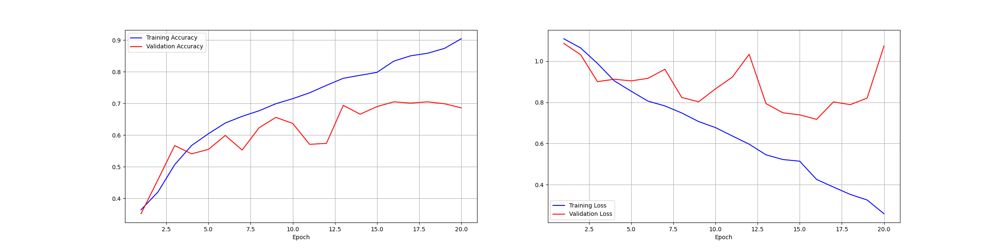

# Model 1

## Initial Network

Training basic_model for 1 epochs  
Model: "sequential"
_________________________________________________________________
 Layer (type)                Output Shape              Param #

=================================================================  
 rescaling (Rescaling)       (None, 150, 150, 3)       0

 conv2d (Conv2D)             (None, 150, 150, 16)      448

 max_pooling2d (MaxPooling2D  (None, 75, 75, 16)       0
 )

 conv2d_1 (Conv2D)           (None, 75, 75, 24)        3480

 max_pooling2d_1 (MaxPooling  (None, 37, 37, 24)       0
 2D)

 conv2d_2 (Conv2D)           (None, 37, 37, 32)        6944

 max_pooling2d_2 (MaxPooling  (None, 18, 18, 32)       0
 2D)

 conv2d_3 (Conv2D)           (None, 18, 18, 32)        9248

 max_pooling2d_3 (MaxPooling  (None, 9, 9, 32)         0
 2D)

 flatten (Flatten)           (None, 2592)              0

 dense (Dense)               (None, 48)                124464

 dense_1 (Dense)             (None, 3)                 147

=================================================================  
Total params: 144,731  
Trainable params: 144,731  
Non-trainable params: 0  

## Plots

## Accuracy of best model

30/30 [==============================] - 3s 88ms/step - loss: 0.9366 - accuracy: 0.7087  
Test loss: 0.9365782737731934 | Test accuracy: 0.7087024450302124  
