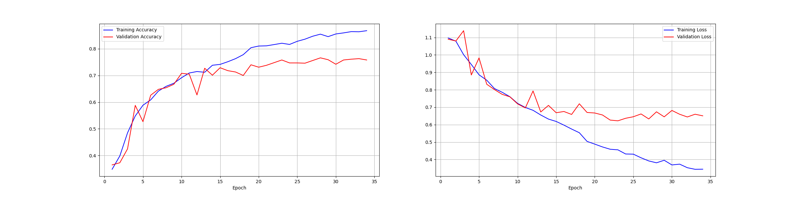

# Model 2

## Initial Network

_________________________________________________________________
 Layer (type)                Output Shape              Param #

=================================================================  
 rescaling_9 (Rescaling)     (None, 150, 150, 3)       0

 conv2d_36 (Conv2D)          (None, 150, 150, 16)      448

 max_pooling2d_36 (MaxPoolin  (None, 75, 75, 16)       0
 g2D)

 conv2d_37 (Conv2D)          (None, 75, 75, 24)        3480

 max_pooling2d_37 (MaxPoolin  (None, 37, 37, 24)       0
 g2D)

 conv2d_38 (Conv2D)          (None, 37, 37, 32)        6944

 max_pooling2d_38 (MaxPoolin  (None, 18, 18, 32)       0
 g2D)

 conv2d_39 (Conv2D)          (None, 18, 18, 32)        9248

 max_pooling2d_39 (MaxPoolin  (None, 9, 9, 32)         0
 g2D)

 dropout_6 (Dropout)         (None, 9, 9, 32)          0

 flatten_9 (Flatten)         (None, 2592)              0

 dense_18 (Dense)            (None, 48)                124464

 dropout_7 (Dropout)         (None, 48)                0

 dense_19 (Dense)            (None, 3)                 147

=================================================================  
Total params: 144,731  
Trainable params: 144,731  
Non-trainable params: 0  
_________________________________________________________________

## Plots

## Accuracy of Best Model

30/30 [==============================] - 2s 57ms/step - loss: 0.6535 - accuracy: 0.7598  
Test loss: 0.6534808278083801 | Test accuracy: 0.7597706913948059

## Hyper-Parameter Optimization

We implemented a grid search for this model. We kept the same fixed network from the first model and varied the two dropout locations and the optimizer learning rate. The search checked 12 configurations: dropout after conv layers in {None, 0.25}, dropout after the dense layer in {None, 0.5}, and learning rate in {0.001, 0.0005, 0.0001}. Each configuration is trained for the same number of epochs, using EarlyStopping and ReduceLROnPlateau to guard against overfitting and plateaued validation accuracy. The selection criterion is best validation accuracy across epochs.

This model saw a 5% jump in accuracy over our orignal model.
