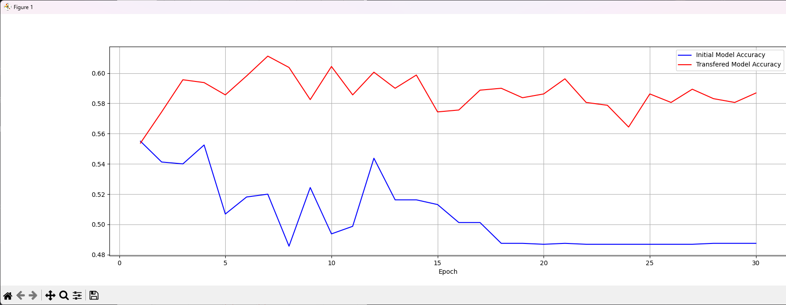

# Transfered model

## Network
Training transfered_model for 30 epochs
Model: "functional_27"

Layer (type)                 ┃ Output Shape          ┃     Param # \
input_layer (InputLayer)     │ (None, 150, 150, 3)   │           0 \
rescaling (Rescaling)        │ (None, 150, 150, 3)   │           0 \
conv2d (Conv2D)              │ (None, 150, 150, 16)  │         448 \
max_pooling2d (MaxPooling2D) │ (None, 75, 75, 16)    │           0 \
conv2d_1 (Conv2D)            │ (None, 75, 75, 24)    │       3,480 \
max_pooling2d_1              │ (None, 37, 37, 24)    │           0 \
(MaxPooling2D)               │                       │             \
conv2d_2 (Conv2D)            │ (None, 37, 37, 32)    │       6,944 \
max_pooling2d_2              │ (None, 18, 18, 32)    │           0 \
(MaxPooling2D)               │                       │             \
conv2d_3 (Conv2D)            │ (None, 18, 18, 32)    │       9,248 \
max_pooling2d_3              │ (None, 9, 9, 32)      │           0 \
(MaxPooling2D)               │                       │             \
flatten (Flatten)            │ (None, 2592)          │           0 \
dense (Dense)                │ (None, 48)            │     124,464 \
transfer_dense_1 (Dense)     │ (None, 64)            │       3,136 \
transfer_dense_2 (Dense)     │ (None, 48)            │       3,120 \
transfer_output (Dense)      │ (None, 2)             │          98 \

Total params: 150,938 (589.60 KB)
Trainable params: 6,354 (24.82 KB)
Non-trainable params: 144,584 (564.78 KB)

## Plot
Far Transfer from Facial Recognition to "Dogs v Cats"

## Accuracy
11s 55ms/step - accuracy: 0.6287 - loss: 0.7048

## An image of each class in the problem of your choice

